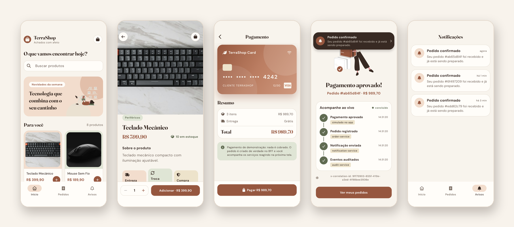
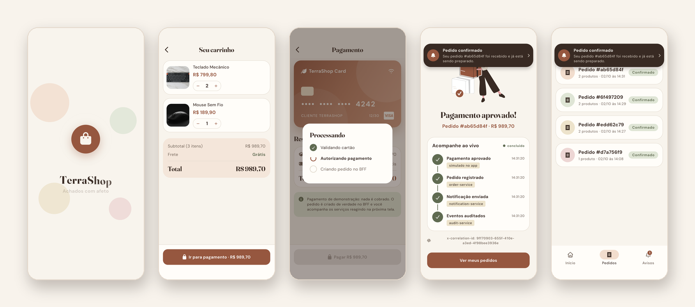

# TerraShop

App Flutter do **Marketplace BFF**. Ele consome apenas os contratos `/api/mobile/*` do BFF e mostra, ao vivo, o fluxo assíncrono do backend: o pedido é criado, o `notification-service` reage ao evento e a notificação chega no app.



## O fluxo

1. **Vitrine** (`GET /api/mobile/home`): produtos com busca que ignora acentos.
2. **Produto** (`GET /api/mobile/products/:id`): foto em Hero, estoque e quantidade.
3. **Carrinho**: em memória, com ajuste de quantidade e deslizar para remover.
4. **Pagamento fake**: validação e autorização são simuladas no app; o pedido é criado de verdade com `POST /api/mobile/orders` e um `x-correlation-id` gerado pelo app.
5. **Confirmação**: timeline ao vivo (`GET /api/mobile/orders/:id/timeline`) mostrando cada serviço que processou o pedido: `order-service`, `notification-service` e `audit-service`.
6. **Notificação**: o app consulta `GET /api/mobile/notifications` e exibe um aviso no topo quando o evento `notification.sent` aparece.



```text
App ── POST /api/mobile/orders ──▶ BFF ──▶ Order Service
                                                │ order.created
                                                ▼
                                             RabbitMQ ──▶ Notification Service
                                                │                │ notification.sent
                                                ▼                ▼
                                             Audit Service (registra todos os eventos)
                                                ▲
App ◀── GET /api/mobile/notifications ── BFF ───┘
```

## Rodando

Suba o backend na raiz do monorepo:

```sh
docker compose up --build
```

Depois, rode o app:

```sh
flutter pub get
flutter run
```

O endereço do BFF fica em [`lib/config/bff_config.dart`](lib/config/bff_config.dart): o emulador Android usa `http://10.0.2.2:3000` e as demais plataformas usam `http://localhost:3000`. Em aparelho físico, passe o IP da sua máquina:

```sh
flutter run --dart-define=BFF_BASE_URL=http://192.168.0.10:3000
```

Não há login: o app usa o cliente fixo `customer-terrashop`.

## Testes

```sh
flutter analyze
flutter test
```

A jornada completa também roda como teste de integração contra o backend real. Ele salva um screenshot por etapa em `screenshots/`:

```sh
flutter drive \
  --driver=test_driver/integration_test.dart \
  --target=integration_test/shopping_journey_test.dart
```

## Arquitetura

MVVM em camadas, seguindo a skill `flutter-apply-architecture-best-practices`:

```text
lib/
├── config/        # endereço do BFF e cliente demo
├── data/          # BffApiClient, modelos dos contratos e repositórios
├── domain/        # modelos do app (preços em centavos)
└── ui/
    ├── core/      # tema, animações, widgets e AppScope (injeção manual)
    └── features/  # splash, home, product, cart, checkout, orders, notifications, shell
```

- **ViewModels:** são `ChangeNotifier`, e o estado de cada tela é uma `sealed class`.
- **Pacotes:** `http`, `flutter_svg` e `font_awesome_flutter`, sem pacote de gerência de estado ou de DI.
- **Movimento:**
  - splash animada com revelação circular;
  - cascata de entrada que espera a transição de tela terminar;
  - skeletons com brilho e Hero da foto do produto.
  - Tudo respeita a opção "reduzir movimento" do sistema.

## Créditos

- Ilustrações: [unDraw](https://undraw.co), recoloridas para a paleta do app.
- Ícones: [Font Awesome Free](https://fontawesome.com).
- Fontes: [Fraunces](https://github.com/undercasetype/Fraunces) e [DM Sans](https://github.com/googlefonts/dm-fonts) (SIL Open Font License).
- Fotos dos produtos: [Unsplash](https://unsplash.com).
