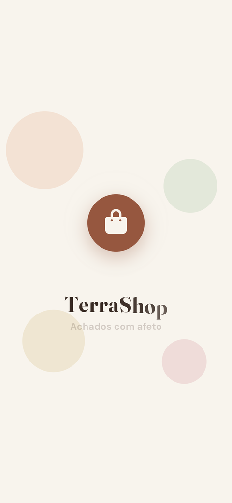
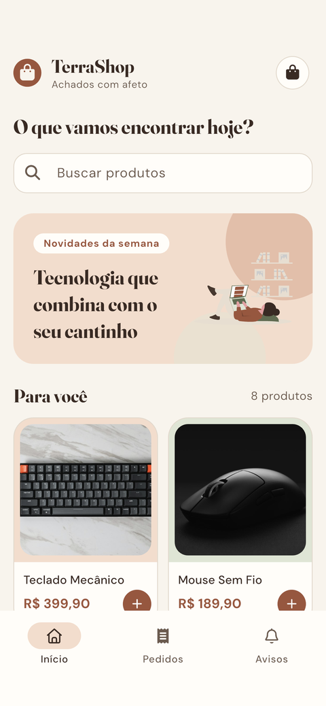
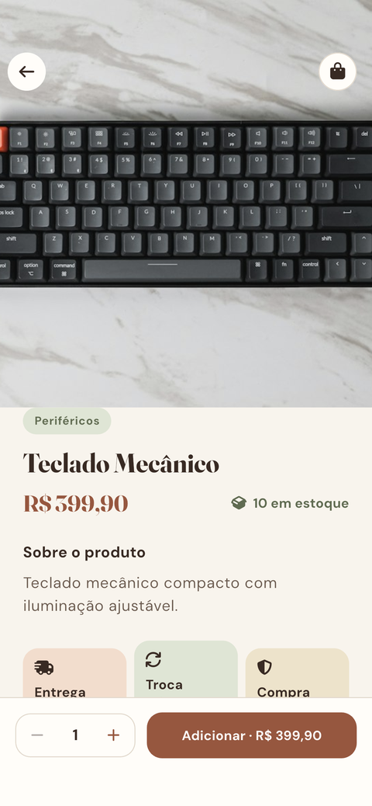
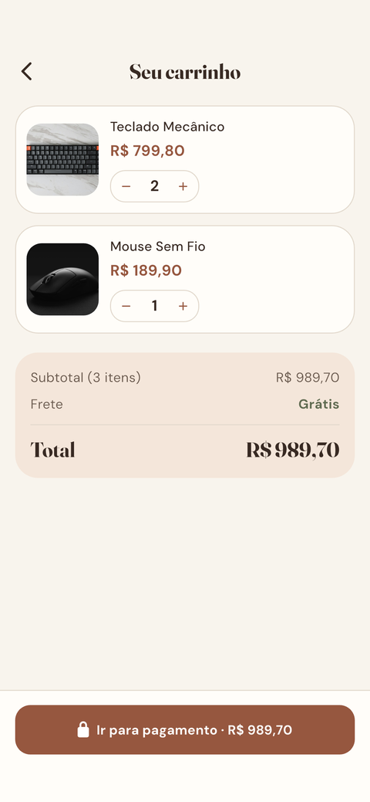
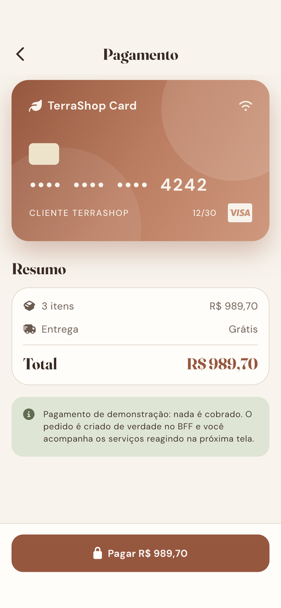
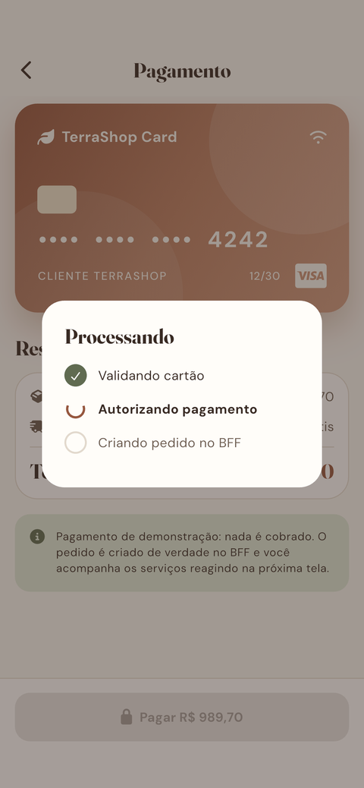
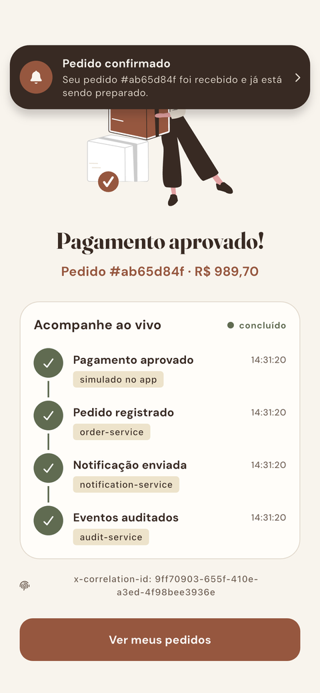
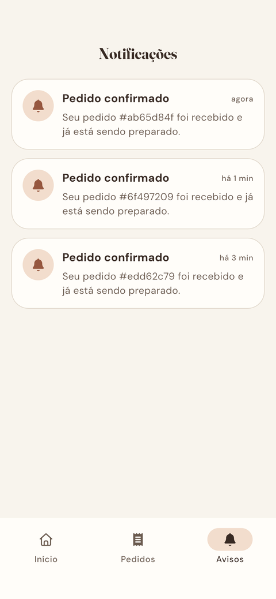
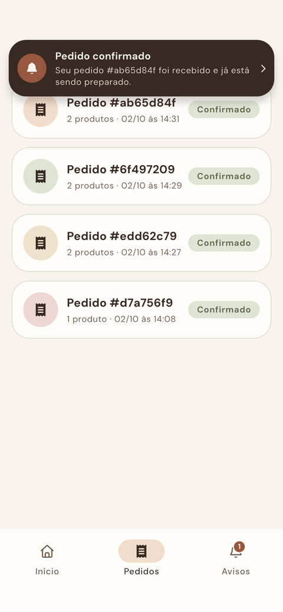

# TerraShop

App mobile em Flutter do **Marketplace BFF**. Ele conversa com um único backend, o BFF (Backend for Frontend), e mostra **ao vivo** o que acontece por trás de uma compra: o pedido é criado no Order Service, o evento passa pelo RabbitMQ, o Notification Service reage, o Audit Service registra tudo e a notificação chega de volta no celular.


---

## Sumário

- [As telas](#as-telas)
- [O BFF por trás do app](#o-bff-por-trás-do-app)
- [Contratos mobile consumidos](#contratos-mobile-consumidos)
- [Resiliência que o app herda do BFF](#resiliência-que-o-app-herda-do-bff)
- [Rodando](#rodando)
- [Testes](#testes)
- [Arquitetura do app](#arquitetura-do-app)
- [Créditos](#créditos)

---

## As telas

### Abertura e vitrine

<table>
  <tr>
    <td align="center"></td>
    <td align="center"></td>
    <td align="center"></td>
  </tr>
  <tr>
    <td align="center"><b>Splash</b><br>Logo elástico, marca letra a letra e revelação circular para o app. A vitrine já carrega durante a animação.</td>
    <td align="center"><b>Vitrine</b><br>Produtos de <code>GET /api/mobile/home</code>, busca que ignora acentos, cards em cascata e adicionar rápido.</td>
    <td align="center"><b>Produto</b><br>Detalhe de <code>GET /api/mobile/products/:id</code>, com a foto "voando" do card (Hero), estoque e quantidade.</td>
  </tr>
</table>

### Compra

<table>
  <tr>
    <td align="center"></td>
    <td align="center"></td>
    <td align="center"></td>
  </tr>
  <tr>
    <td align="center"><b>Carrinho</b><br>Em memória, com quantidades, deslizar para remover e resumo do pedido.</td>
    <td align="center"><b>Pagamento</b><br>Cartão de demonstração: nada é cobrado. O pedido, porém, é criado de verdade.</td>
    <td align="center"><b>Processando</b><br>Validação e autorização simuladas; a última etapa é o <code>POST /api/mobile/orders</code> real.</td>
  </tr>
</table>

### Os serviços reagindo

<table>
  <tr>
    <td align="center"></td>
    <td align="center"></td>
    <td align="center"></td>
  </tr>
  <tr>
    <td align="center"><b>Pedido confirmado</b><br>Timeline ao vivo: cada etapa acende quando o serviço correspondente processa o evento. Mostra também o <code>x-correlation-id</code> do fluxo.</td>
    <td align="center"><b>Aviso no app</b><br>Quando o <code>notification-service</code> publica <code>notification.sent</code>, o aviso desce no topo de qualquer tela.</td>
    <td align="center"><b>Notificações</b><br>Histórico vindo de <code>GET /api/mobile/notifications</code>, com badge de não lidas na navegação.</td>
  </tr>
</table>

<p align="center">
  <br>
  <b>Meus pedidos</b>: lista reduzida de <code>GET /api/mobile/orders</code>.
</p>

---

## O BFF por trás do app

O TerraShop **não conhece** os serviços internos do marketplace. Ele só fala com o **Marketplace BFF** ([`apps/bff`](../apps/bff), NestJS + Fastify), que tem uma API sob medida para cada cliente:

```text
                     ┌──────────────────────────────────────────┐
  TerraShop  ──────▶ │  Marketplace BFF  :3000                  │
  (Flutter)          │  /api/mobile/*   contratos do app        │
                     │  /api/web/*      contratos da web        │
  Web        ──────▶ │  timeout · retry · circuit breaker       │
                     └───────┬───────────────┬──────────────┬───┘
                             │               │              │
                             ▼               ▼              ▼
                     Catalog Service   Order Service   Audit Service
                         :3003            :3001           :3002
                                            │ order.created  ▲
                                            ▼                │ todos os eventos
                                        RabbitMQ ────────────┤
                                            │                │
                                            ▼                │
                                   Notification Service ─────┘
                                     notification.sent
```

### Por que um BFF?

- **Contrato do tamanho da tela.** O catálogo tem `description`, `category` e `stock` para cada produto, mas a vitrine só precisa de 4 campos, e é só isso que `/api/mobile/home` entrega. A web recebe o produto completo em `/api/web/home`.
- **Um só endereço.** O app não sabe onde ficam Catalog, Order ou Audit, nem que existe RabbitMQ. Se um serviço mudar, o app não precisa ser atualizado.
- **Erros previsíveis.** Qualquer falha interna vira o mesmo formato público, sem stack trace nem hostname do Docker.
- **Composição.** A timeline do pedido junta eventos de vários serviços em uma única resposta pronta para a tela.

### Do toque no botão até a notificação

1. O app gera um `x-correlation-id` e chama `POST /api/mobile/orders`.
2. O BFF valida o payload e repassa ao **Order Service**, propagando o correlation id.
3. O Order Service cria o pedido e publica `order.created` na exchange `marketplace.events`.
4. O **Notification Service** consome o evento e publica `notification.sent`.
5. O **Audit Service** registra os dois eventos.
6. O app consulta a timeline e as notificações pelo BFF, que monta as respostas a partir dos eventos auditados. A tela acende etapa por etapa.

Tudo isso acontece em menos de 100 ms localmente. A timeline no app é real, não animação decorativa.

---

## Contratos mobile consumidos

| Tela | Endpoint | O que o app recebe |
|---|---|---|
| Vitrine | `GET /api/mobile/home` | `products[]` com `id`, `name`, `price`, `thumbnail` |
| Produto | `GET /api/mobile/products/:id` | `id`, `name`, `description`, `price`, `image`, `category`, `stock` |
| Pagamento | `POST /api/mobile/orders` | pedido criado (`id`, `status`, `createdAt`), com o header `x-correlation-id` |
| Meus pedidos | `GET /api/mobile/orders` | `id`, `status`, `itemsCount`, `createdAt` |
| Confirmação | `GET /api/mobile/orders/:id/timeline` | eventos do pedido, com o serviço de origem e a hora |
| Notificações | `GET /api/mobile/notifications?customerId=` | notificações enviadas ao cliente |

Exemplo da vitrine, enxuta para o mobile:

```json
{
  "products": [
    {
      "id": "product-001",
      "name": "Teclado Mecânico",
      "price": 399.9,
      "thumbnail": "https://images.unsplash.com/photo-1618384887929-16ec33fab9ef?w=800&h=600&fit=crop&q=80&fm=jpg"
    }
  ]
}
```

Exemplo da timeline que alimenta a tela de confirmação:

```json
{
  "orderId": "d7a756f9-d781-46d8-a6d9-52cb2e233545",
  "steps": [
    {
      "event": "order.created",
      "service": "order-service",
      "occurredAt": "2026-10-02T17:08:26.327Z",
      "auditedAt": "2026-10-02T17:08:26.391Z"
    },
    {
      "event": "notification.sent",
      "service": "notification-service",
      "occurredAt": "2026-10-02T17:08:26.393Z",
      "auditedAt": "2026-10-02T17:08:26.403Z"
    }
  ]
}
```

> O BFF manda preços em reais (`399.9`). O app converte para centavos (`39990`) logo no repositório e nunca faz conta de dinheiro com `double`.

---

## Resiliência que o app herda do BFF

| No BFF | Como aparece no app |
|---|---|
| **Contrato de erro único** (`statusCode`, `error`, `message`, `correlationId`) | Vira `BffException` no `BffApiClient`; a tela mostra a mensagem com ilustração e o botão "Tentar de novo". |
| **Timeout de 2 s para cada serviço interno** | O app nunca espera indefinidamente; ele ainda tem o próprio timeout de 8 s por chamada. |
| **Retry só em GETs** com falha transitória | A vitrine se recupera sozinha de falhas breves. O `POST` do pedido **não** é repetido, para não duplicar compra; se falhar, o carrinho é mantido. |
| **Circuit breaker** por serviço | Com o catálogo fora do ar, o BFF responde rápido com 503 em vez de travar o app. |
| **Fallback do Audit** (dependência opcional) | Se o Audit cair, notificações e timeline voltam vazias e a compra continua funcionando. |
| **`x-correlation-id` propagado** | O id gerado no app aparece na tela de confirmação e liga os logs de todos os serviços daquela compra. |

Os cenários de falha (catálogo fora, Order fora, retry, DLQ, readiness) estão em [`docs/resilience.md`](../docs/resilience.md). Dá para rodá-los com o app aberto e ver cada tela reagir.

---

## Rodando

1. Suba o backend na raiz do monorepo:

   ```sh
   docker compose up --build
   ```

2. Rode o app:

   ```sh
   flutter pub get
   flutter run
   ```

O endereço do BFF fica em [`lib/config/bff_config.dart`](lib/config/bff_config.dart): o emulador Android usa `http://10.0.2.2:3000` e o simulador iOS, o macOS e a web usam `http://localhost:3000`. Em aparelho físico, aponte para o IP da sua máquina:

```sh
flutter run --dart-define=BFF_BASE_URL=http://192.168.0.10:3000
```

> O app usa o cliente fixo `customer-terrashop` e não tem login. O pagamento é de demonstração: nada é cobrado.

---

## Testes

```sh
flutter analyze
flutter test
```

- **Unitários:** cliente HTTP (com `MockClient`), repositórios e ViewModels.
- **De widget:** cobrem os estados de cada tela, fonte grande e layout responsivo.
- **Jornada completa:** um teste de integração faz a compra inteira contra o BFF real e salva um screenshot por etapa em `screenshots/`. As imagens deste README saíram dele.

```sh
flutter drive \
  --driver=test_driver/integration_test.dart \
  --target=integration_test/shopping_journey_test.dart
```

---

## Arquitetura do app

MVVM em camadas, seguindo as boas práticas oficiais do Flutter:

```text
lib/
├── config/        # endereço do BFF e cliente demo
├── data/          # BffApiClient, modelos dos contratos e repositórios
├── domain/        # modelos do app (preços em centavos)
└── ui/
    ├── core/      # tema, animações, widgets e AppScope (injeção manual)
    └── features/  # splash, home, product, cart, checkout, orders, notifications, shell
```

- **Fluxo de dados:** `BffApiClient` → Repository → ViewModel (`ChangeNotifier`) → View. Widgets nunca chamam HTTP.
- **Estado:** cada tela tem uma `sealed class` de estados, e a View faz um `switch` exaustivo.
- **Dependências:** só `http`, `flutter_svg` e `font_awesome_flutter`, sem pacote de estado ou de DI.
- **Movimento:**
  - splash com revelação circular;
  - entrada em cascata que espera a transição terminar;
  - skeletons com brilho e Hero da foto;
  - timeline animada e aviso que desce com um sininho balançando.
  - Tudo respeita a opção "reduzir movimento" do sistema.
- **Visual:** paleta terrosa com pastéis, Fraunces nos títulos e DM Sans no texto.

---

## Créditos

- Ilustrações: [unDraw](https://undraw.co), recoloridas para a paleta do app.
- Ícones: [Font Awesome Free](https://fontawesome.com).
- Fontes: [Fraunces](https://github.com/undercasetype/Fraunces) e [DM Sans](https://github.com/googlefonts/dm-fonts) (SIL Open Font License).
- Fotos dos produtos: [Unsplash](https://unsplash.com).
